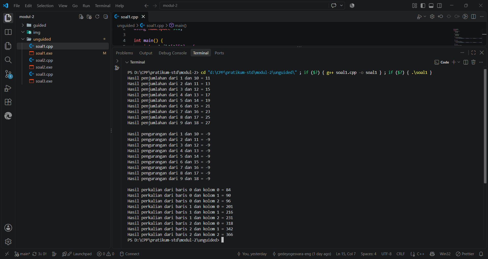
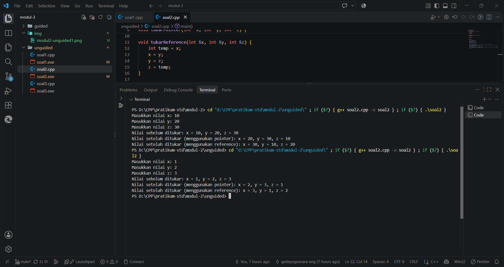
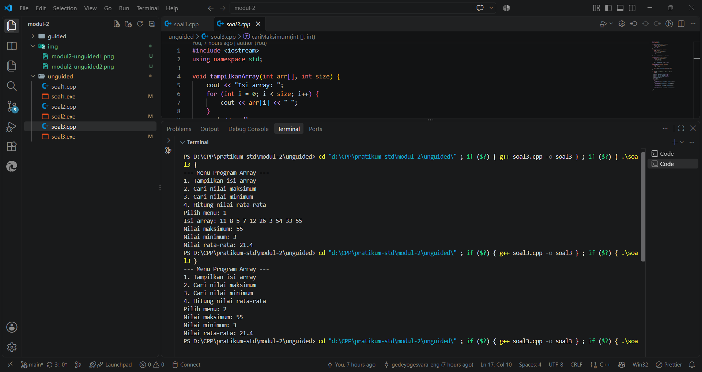
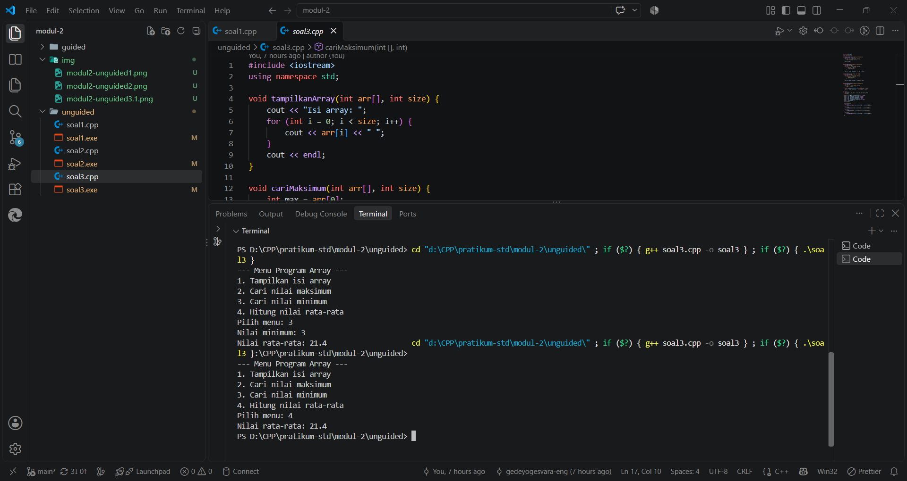

# <h1 align="center">Laporan Praktikum Modul 2 - PENGENALAN BAHASA C++ (BAGIAN KEDUA)</h1>
<p align="center">Gede Yogi Yogesvara Dita Diasta - 109082500037</p>

## Dasar Teori

### A. Array<br/>
Array adalah struktur data yang digunakan untuk menyimpan kumpulan elemen dengan tipe data yang sama secara berurutan di dalam memori komputer. Setiap elemen di dalam array dapat diakses menggunakan indeks numerik, yang biasanya dimulai dari angka nol

#### 1. Array Satu Dimensi
Array satu dimensi adalah merepresentasikan kumpulan data dalam satu baris deklarasi array ini biasanya menentukan tipe data nama array dan kapasitas elemennya.
#### 2. Array Multi Dimensi
Array multi dimensi seperti array dua dimensi merepresentasikan data dalam bentuk tabel atau matriks yang memiliki baris dan kolom. 

### B. Pointer<br/>
Pointer adalah variabel khusus yang tidak menyimpan nilai data secara langsung, melainkan menyimpan alamat memori dari variabel lain.
#### 1. Operator Address &
Operator & digunakan untuk mendapatkan alamat memori dari suatu variabel. Jika kita memiliki variabel x, maka &x akan mengembalikan alamat lokasi memori tempat x disimpan.
#### 2. Operator Dereference *
Operator * digunakan untuk mengakses nilai yang tersimpan pada alamat memori yang ditunjuk oleh sebuah pointer.

### C. Fungsi dan Prosedur<br/>
Fungsi dan prosedur adalah blok kode yang dirancang untuk melakukan tugas tertentu dan dapat dipanggil berulang kali di berbagai bagian program.
#### 1. Prosedur
Prosedur adalah blok kode yang mengeksekusi serangkaian instruksi tanpa mengembalikan nilai return value
#### 2. Fungsi
Fungsi adalah blok kode yang melakukan proses tertentu dan wajib mengembalikan suatu nilai return value

## Guided 

### 1. Array satu dimensi

```C++
#include <iostream>
using namespace std;

int main() {
    int nilai[5];

    nilai[0] = 80;
    nilai[1] = 85;
    nilai[2] = 90;
    nilai[3] = 75;
    nilai[4] = 95;

    for (int i = 0; i <= 5; i++) {
        cout << "index ke-" << i << " = " << nilai[i] << endl;
    }

    return 0;
}
```
penjelasan singkat guided 1
Program ini pembuatan dan penggunaan array satu dimensi yang menampung tipe data bilangan bulat int array nilai dideklarasikan dengan kapasitas 5 kemudian dimasukkan secara manual ke dalam masing-masing indeks dari 0 sampai ke 4 lalu program menggunakan perulangan untuk mencetak isi dari array.

### 2. Array Dua Dimensi

```C++
#include <iostream>
using namespace std;

int main() {
    int nilai[3][3] = {
        {80, 85, 90},
        {75, 80, 85},
        {90, 95, 100}
    };

    cout << nilai[0][0] << endl;
    cout << nilai[1][1] << endl;
    cout << nilai[2][2] << endl;

    return 0;
}
```
penjelasan singkat guided 2
Program ini mendemonstrasikan penggunaan array dua dimensi berukuran 3x3 yang datanya diinisialisasi secara langsung saat dideklarasi lalu pemanggilan data dilakukan secara spesifik dengan merujuk pada indeks baris dan kolomnya.

### 3. Array tiga dimensi

```C++
#include <iostream>
using namespace std;

int main() {
    int data[3][3][3] = {
        {
            {1, 2, 3},
            {4, 5, 6},
            {7, 8, 9}
        },
        {
            {10, 11, 12},
            {13, 14, 15},
            {16, 17, 18}
        }
    };

    cout << data[0][1][1] << endl;

    return 0;

}
```
penjelasan singkat guided 3
Program ini mengimplementasikan penggunaan array tiga dimensi berukuran 3x3x3 tipe datanya integer lalu data diinisialisasi secara langsung ke dalam matriks blok, baris, dan kolom saat deklarasi lalu dilakukan mencetak secara spesifik dengan memanggil ketiga indeks contohnya blok 0 baris 1 dan kolom 1.

### 4. Array empat dimensi

```C++
#include <iostream>
using namespace std;

int main() {
    int data[2][2][2][2] = {
    {
        {
            {1, 2},
            {3, 4}
        },
        {
            {5, 6},
            {7, 8}
        },
    },
    {
        {
            {9, 10},
            {10, 11}
        },
        {
            {12, 13},
            {14, 15}
        }
    }
};
    
    cout << data[0][0][1][1] << endl;

    return 0;
}
```
penjelasan singkat guided 4
Program ini mengimplementasikan penggunaan array empat dimensi berukuran 2x2x2x2 tipe datanya integer lalu data diinisialisasi secara langsung ke dalam matriks blok, baris, dan kolom saat deklarasi lalu dilakukan mencetak nilai pada indeks [0][0][1][1].

### 5. Pointer

```C++
#include <iostream>
using namespace std;

int main() {
    char a;
    int j;
    char arr[6];

    arr[3] = 'b';
    a ='u';
    j = 10;

    cout << a << endl;
    cout << &a << endl;

    cout << j << endl;
    cout << &j << endl;

    cout << arr[3] << endl;
    cout << &(arr[3]) << endl;
    return 0;
}
```
penjelasan singkat guided 5
Program ini cara menampilkan nilai suatu variabel beserta alamat memorinya menggunakan operator address & lalu program mendeklarasikan variabel bertipe karakter char, bilangan bulat int, dan array setelah nilai diinisialisasi program mencetak data tersebut diikuti dengan lokasi alamat memori tempat data tersebut disimpan

### 6. Pointer dan dereference

```C++
#include <iostream>
using namespace std;

int main() {
    int x, y;
    int *px;

    x = 87;
    px = &x;
    y = *px;

    cout << "Alamat x = " << &x << endl;
    cout << "Isi px = " << px << endl;
    cout << "Isi x = " << x << endl;
    cout << "Nilai yang ditunjuk px = " << *px << endl;
    cout << "Nilai y = " << y << endl;

    return 0;
}
```
penjelasan singkat guided 6
Program ini penggunaan variabel pointer tipe datanya integer *px pointer px untuk menyimpan alamat memori dari variabel x menggunakan address &x lalu program menunjukkan penggunaan operator dereference *px untuk mengambil nilai yang berada di dalam alamat memori yang ditunjuk oleh pointer tersebut yaitu 87 lalu nilainya disalin ke dalam variabel y

### 7. Array karakter

```C++
#include <iostream>
using namespace std;

int main() {
    char nama[] = "strukdat";

    cout << nama << endl;
    cout << nama[3] << endl;
}
```
penjelasan singkat guided 7
Program ini penggunaan array bertipe karakter char yang berfungsi untuk menyimpan data string teks variabel array nama diinisialisasi secara langsung dengan "strukdat" lalu menampilkan keseluruhan kata tersebut dan juga menampilkan elemen pada indeks ke 3 yang menghasilkan huruf u.

### 8. Fungsi

```C++
#include <iostream>
using namespace std;

int maks3(int a, int b, int c);
int main(){
    int x, y, z;
    cout << "masukkan nilai bilangan ke-1 = ";
    cin >> x;
    cout << "masukkan nilai bilangan ke-2 = ";
    cin >> y;
    cout << "masukkan nilai bilangan ke-3 = ";
    cin >> z;
    cout << "nilai maksimumnya adalah = " << maks3(x, y, z) << endl;
    return 0;
}

int maks3(int a, int b, int c){
    int temp_max = a;
    if(b > temp_max){
    temp_max = b;
    }
    if(c > temp_max){
    temp_max = c;
    }
    return temp_max;
}
```
penjelasan singkat guided 8
Kode ini mengimplementasikan sebuah fungsi bernama maks3 bertipe int lalu fungsi ini menerima tiga parameter a, b, dan c dari input pengguna lalu melakukan logika if untuk mencari nilai yang paling besar hasil dari fungsi tersebut kemudian dikembalikan ke fungsi utama menggunakan perintah return agar bisa ditampilkan.

### 9. Prosedur

```C++
#include <iostream>
using namespace std;

void tulis(int x);
int main() {
    int jum;
    cout << "jumlah baris kata = ";
    cin >> jum;
    tulis(jum);
    return 0;
}

void tulis(int x){
    for (int i=0; i<x; i++)
    cout << "baris ke-" << i+1 << endl;
}
```
penjelasan singkat guided 9
Kode ini penggunaan prosedur yaitu blok fungsi yang tidak memiliki nilai kembalian prosedur tulis menerima parameter berupa angka batas dari pengguna kemudian mengeksekusi perulangan for untuk mencetak teks ke layar karena bertipe void prosedur tidak menggunakan perintah return

### 10. Parameter fungsi

```C++
#include <iostream>
using namespace std;

void tukarValue(int x, int y) {
    int temp = x;
    x = y;
    y = temp;
}

void tukarPointer(int *x, int *y) {
    int temp = *x;
    *x = *y;
    *y = temp;
}

void tukarReference(int &x, int &y) {
    int temp = x;
    x = y;
    y = temp;
}

int main() {
    int a = 4, b = 6;

    tukarValue(a, b);
    cout << "Setelah Call by Value     -> a = " << a << ", b = " << b << " (Tetap)" << endl;

    tukarPointer(&a, &b);
    cout << "Setelah Call by Pointer   -> a = " << a << ", b = " << b << " (Berubah!)" << endl;

    tukarReference(a, b);
    cout << "Setelah Call by Reference -> a = " << a << ", b = " << b << " (Berubah lagi!)" << endl;

    return 0;
}

  
```
penjelasan singkat guided 10
kode ini terdapat tiga cara passing parameter ke dalam fungsi pertama adalah call by value di mana fungsi hanya menerima salinan nilainya saja apapun perubahan di dalam fungsi tidak akan memengaruhi variabel aslinya di fungsi main kedua adalah call by pointeri sini mengirim alamat memori dari variabel menggunakan operator & dan ditangkap dengan pointer * pada parameter karena berinteraksi langsung dengan alamat memori modifikasi di dalam fungsi akan ikut mengubah variabel aslinya lalu ada call by reference fungsinya sama seperti pointer yang memodifikasi variabel asli tapi menggunakan & di parameternya.

## Unguided 

### 1. Buatlah program yang dapat melakukan operasi penjumlahan, pengurangan, dan perkalian matriks 3x3 

```C++
#include <iostream>
using namespace std;

int main() {
    int matrikA[3][3] = {
        {1, 2, 3},
        {4, 5, 6},
        {7, 8, 9}
    };

    int matrikB[3][3] = {
        {10, 11, 12},
        {13, 14, 15},
        {16, 17, 18}
    };

    for (int i=0; i<3; i++) {
        for (int j = 0; j<3; j++) {
            cout << "Hasil penjumlahan dari " << matrikA[i][j] << " dan " << matrikB[i][j] << " = " << matrikA[i][j] + matrikB[i][j] << endl;
        }
    }

    cout << endl;

    for (int k =0; k < 3; k++) {
        for (int l =0; l < 3; l++) {
            cout << "Hasil pengurangan dari " << matrikA[k][l] << " dan " << matrikB[k][l] << " = " << matrikA[k][l] -matrikB[k][l] << endl;
        }
    }

    cout << endl;

    for (int m = 0; m < 3; m++){
        for (int n = 0; n < 3; n++) {
            int hasil = 0;
            for (int o = 0; o < 3; o++) {
                hasil += matrikA[m][o] * matrikB[o][n];
            }
            cout << "Hasil perkalian dari baris " << m << " dan kolom " << n << " = " << hasil << endl;
        }
    }

    return 0;
}
```
### Output Unguided 1 :

##### Output 


### 2. Berdasarkan guided pointer dan reference sebelumnya, buatlah keduanya dapat menukar nilai dari 3 variabel 

```C++
#include <iostream>
using namespace std;

void tukarPointer(int *x, int *y, int *z) {
    int temp = *x;
    *x = *y;
    *y = *z;
    *z = temp;
}

void tukarReference(int &x, int &y, int &z) {
    int temp = x;
    x = y;
    y = z;
    z = temp;
}

int main() {
    int x, y, z;

    cout << "Masukkan nilai x: ";
    cin >> x;
    cout << "Masukkan nilai y: ";
    cin >> y;
    cout << "Masukkan nilai z: ";
    cin >> z;

    cout << "Nilai sebelum ditukar: x = " << x << ", y = " << y << ", z = " << z << endl;

    tukarPointer(&x, &y, &z);
    cout << "Nilai setelah ditukar (menggunakan pointer): x = " << x << ", y = " << y << ", z = " << z << endl;

    tukarReference(x, y, z);
    cout << "Nilai setelah ditukar (menggunakan reference): x = " << x << ", y = " << y << ", z = " << z << endl;

    return 0;
}

```
### Output Unguided 2 :

##### Output


penjelasan unguided 2
Program ini untuk menukar nilai dari tiga buah variabel x, y, dan z angka yang diinputkan lalu penukaran nilai dikerjakan menggunakan dua metode yaitu call by pointer dan call by reference di pointer fungsi menerima alamat memori dari variabel lalu menukar nilainya secara langsung dan pada reference fungsi membuat alias dari variabel aslinya untuk mengubah nilai dalam kedua fungsi tersebut nilai ditukar secara berurutan memutar di mana nilai x diganti menjadi y lalu nilai y diganti menjadi z dan nilai z diganti menjadi nilai x.

### 3. Diketahui sebuah array 1 dimensi sebagai berikut :  arrA = {11, 8, 5, 7, 12, 26, 3, 54, 33, 55} Buatlah program yang dapat mencari nilai minimum, maksimum, dan rata – rata dari array tersebut! Gunakan function cariMinimum() untuk mencari nilai minimum dan function cariMaksimum() untuk mencari nilai maksimum, serta gunakan prosedur hitungRataRata() untuk menghitung nilai rata – rata! Buat program menggunakan menu switch-case seperti berikut ini : --- Menu Program Array --- 1. Tampilkan isi array 2. cari nilai maksimum 3. cari nilai minimum 4. Hitung nilai rata - rata 

```C++
#include <iostream>
using namespace std;

void tampilkanArray(int arr[], int size) {
    cout << "Isi array: ";
    for (int i = 0; i < size; i++) {
        cout << arr[i] << " ";
    }
    cout << endl;
}

void cariMaksimum(int arr[], int size) {
    int max = arr[0];
    for (int i = 1; i < size; i++) {
        if (arr[i] > max) {
            max = arr[i];
        }
    }
    cout << "Nilai maksimum: " << max << endl;
}

void cariMinimum(int arr[], int size) {
    int min = arr[0];
    for (int i = 1; i < size; i++) {
        if (arr[i] < min) {
            min = arr[i];
        }
    }
    cout << "Nilai minimum: " << min << endl;
}

void hitungRataRata(int arr[], int size) {
    int sum = 0;
    for (int i = 0; i < size; i++) {
        sum += arr[i];
    }
    double rataRata = static_cast<double>(sum) / size;
    cout << "Nilai rata-rata: " << rataRata << endl;
}

int main() {
    int arrA[] = {11, 8, 5, 7, 12, 26, 3, 54, 33, 55};
    int menu;

   cout << "--- Menu Program Array ---" << endl;
   cout << "1. Tampilkan isi array" << endl;
   cout << "2. Cari nilai maksimum" << endl;
   cout << "3. Cari nilai minimum" << endl;
   cout << "4. Hitung nilai rata-rata" << endl;
   cout << "Pilih menu: ";
   cin >> menu;

   switch(menu) {
    case 1: {
        tampilkanArray(arrA, sizeof(arrA) / sizeof(arrA[0]));
    }
    case 2: {
        cariMaksimum(arrA, sizeof(arrA) / sizeof(arrA[0]));
    }
    case 3: {
        cariMinimum(arrA, sizeof(arrA) / sizeof(arrA[0]));
    }
    case 4: {
        hitungRataRata(arrA, sizeof(arrA) / sizeof(arrA[0]));
    }
   }
}
```
### Output Unguided 3 :

##### Output



penjelasan unguided 3
Program ini menggunakan modular dengan cara membagi setiap tugas menjadi fungsi fungsi void atau prosedur yaitu untuk menampilkan data array, mencari nilai maksimum, mencari nilai minimum, dan menghitung rata-rata di dalam fungsi utama main menggunakan struktur kontrol switch-case untuk menampilkan menu agar pengguna bisa memilih operasi mana yang ingin dijalankan lalu untuk mendapatkan jumlah array secara dinamis menggunakan rumus sizeof(arrA) / sizeof(arrA[0]) yang hasilnya disimpan sebagai parameter ukuran ke dalam setiap fungsi.

## Kesimpulan
Praktikum modul 2 ini pada dasarnya mereview kembali logika mengenai array, pointer, serta fungsi dan prosedur yang sudah saya pahami sebelumnya, sehingga fokus utama saya di modul ini adalah beradaptasi dengan gaya penulisan sintaks C++ dan mengamati perbedaan cara kedua bahasa tersebut menangani memori secara langsung.

## Referensi
[1] Fakultas Informatika. (2026). Modul 2 Pengenalan Bahasa C++ (Bagian Kedua). Telkom University.
[2] Deitel, P., & Deitel, H. (2016). C++ How to Program (10th ed.). Pearson.
